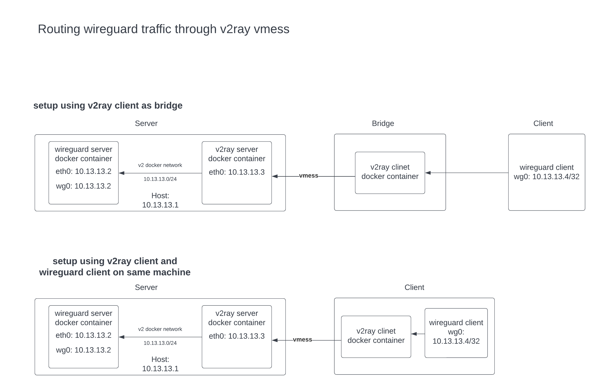

# Dockerized setup of routing wireguard traffic through v2ray vmess

in this setup, we are using a dockerized implementation of server and bridge because of the simplicity of installing.

also wireguard traffic is detectable by authorities so for that case we have to add Obfuscation layer in the network using v2ray vmess.



in picture above, you can see that the setup can be done in two ways,

first way, we can create just one v2ray client and use it as bridge on a seperate machine from the server machine , and only add peers to wireguard server. (bridge)

in second way, you can create a v2ray client for each wireguard peer, and that makes clients to install v2ray client on their machine too. (non-bridge)

### server config:
 server setup for both bridge and non-bridge are the same.

 1. install [docker](https://docs.docker.com/engine/install/ubuntu/) with compose plugin
 2. clone the repo and cd into server directory
 ```
 $ git clone https://github.com/kayvan-eth/wireguard-v2ray-dockerized.git && cd wireguard-v2ray-dockerized/server
 ```

 3. install uuid, create one for v2ray client,
 ```
 $ apt install -y uuid && uuid -v 4
 3ef0f508-4b96-44a6-95d7-6dea91df5eb3
 ```
 and replace the output ( 3ef0f508-4b96-44a6-95d7-6dea91df5eb3 ) with "UUID_V_4" in server/v2config.json file. (keep this id ,we will need it for client/bridge configuration)

4. next we will create a docker network with pre-defined subnet (10.13.13.0/24) that containers can obtain their static ip (you cannot set static ips for containers using default one selected by docker daemon itself)
```
$ docker network create --subnet 10.13.13.0/24 v2
```
5. generate private and public keys for wireguard server and client
```
# generate server private key
$ wg genkey | tee server.private
GGLnkb9acX3fLeGNCRyc1Y66LmtXhF9E4gF6rSJm63c=

# generate server public key
$ cat server.private | wg pubkey | tee server.public
hFdCIFC3buaPF60+zyHHkpuYb4a+j+4D+n5o81OPeHw=

# generate client private key
$ wg genkey | tee client.private 
mH+UMZkA4hUGF8AFZHmoEczq10fJwzDjb099OkaE2Gc=

# generate client public key
$ cat client.private | wg pubkey | tee client.pub
g2pZDLR1zlt39oZnFcJn//WlD6cMCTGZ7mLLk1maCT0=
```
replace "WIREGUARD_SERVER_PRIVATE_KEY" with server.private result and "WIREGUARD_CLIENT_PUBLIC_KEY" with client.public result in wg0.conf

6. start the services :
```
docker compose up -d && docker ps
CONTAINER ID   IMAGE                                  COMMAND                  CREATED       STATUS       PORTS                                                                  NAMES
d49deff12797   linuxserver/wireguard                  "/init"                  3 weeks ago   Up 3 weeks   51820/tcp, 51820/udp                                                   wg
c66862df4107   v2ray/official                         "v2ray -config=/etc/…"   5 weeks ago   Up 3 weeks   0.0.0.0:1433->1433/tcp, 0.0.0.0:1433->1433/udp, 51820/tcp, 51820/udp   v2ray
```

### bridge config:
 1. install [docker](https://docs.docker.com/engine/install/ubuntu/) with compose plugin
 2. clone the repo and cd into bridge directory
 ```
 $ git clone https://github.com/kayvan-eth/wireguard-v2ray-dockerized.git && cd wireguard-v2ray-dockerized/bridge
 ```
 3. edit v2config,json, replace "SERVER_PUBLIC_IP" with your server public ip and "UUID_V_4" with the one you generated before in step 3 of server setup(3ef0f508-4b96-44a6-95d7-6dea91df5eb3) .

 4. start services with command below:
 ```
 $ docker compose up -d && docker ps
 CONTAINER ID   IMAGE            COMMAND                  CREATED       STATUS        PORTS                                             NAMES
 2a454b4cd5ca   v2ray/official   "v2ray -config=/etc/…"   5 weeks ago   Up 34 hours   0.0.0.0:51820->51820/tcp, 0.0.0.0:51820->51820/udp v2ray
 ```

### client config:

if you are using a machine as bridge for v2ray client (first way) , you only need to install wireguard on client devices [Official clients](https://www.wireguard.com/install/)

then edit client/client.conf , replace "WIREGUARD_CLIENT_PRIVATE_KEY" with the one you get from step 5 in 

server setup ( mH+UMZkA4hUGF8AFZHmoEczq10fJwzDjb099OkaE2Gc= ),

"WIREGUARD_SERVER_PUBLIC_KEY" with ( hFdCIFC3buaPF60+zyHHkpuYb4a+j+4D+n5o81OPeHw= ) and for "BRIDGE_PUBLIC_IP" 

replace it with machine public ip, you can get it by running command below on bridge machine:
```
$ curl -s ipinfo.io/ip
``` 

but if you have done the second way , replace "BRIDGE_PUBLIC_IP" with 127.0.0.1 or localhost.

### add more peers:

for adding more peers to network, in the first way you just need to add peer to wireguard server:

```
# generate client2 private key
$ wg genkey | tee client2.private 
IBqFFhWTEqZrJQf9BKKJGZD9OHjftniqvAdgH+O4gGg=

# generate client2 public key
$ cat client2.private | wg pubkey | tee client2.pub
o2+ZNNtI1kDbgaHBhUGFSxL1h0YiAg2/9+g5uW7EFh0=

# add new peer to server/wg0.conf
$ echo "[Peer]
PublicKey = o2+ZNNtI1kDbgaHBhUGFSxL1h0YiAg2/9+g5uW7EFh0=
AllowedIPs = 10.13.13.5/32" >>  wg0.conf
```
after that restart the service
```
$ docker compose down && docker compose up -d
```
then create the appropriate wireguard client config.

in the second way, for every new peer , you should create a client in v2ray server :
```
$ uuid -v 4
4b1ef72e-a814-41ad-92bc-c523e76a2882
```
and add the out put in v2ray config.json like below:
```
            "clients": [
                {
                    "id": "3ef0f508-4b96-44a6-95d7-6dea91df5eb3",
                    "alterId": 233,
                    "security": null
                },
                {
                    "id": "4b1ef72e-a814-41ad-92bc-c523e76a2882",
                    "alterId": 234,
                    "security": null
                }
```